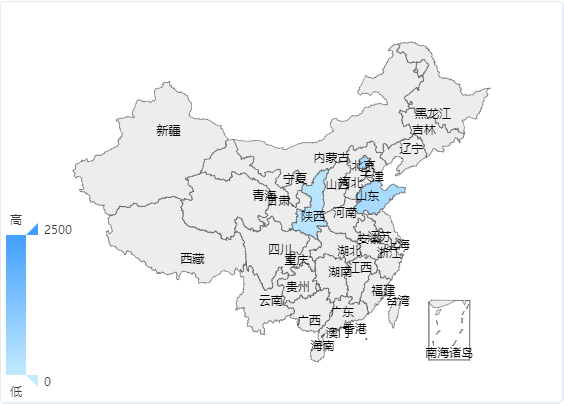
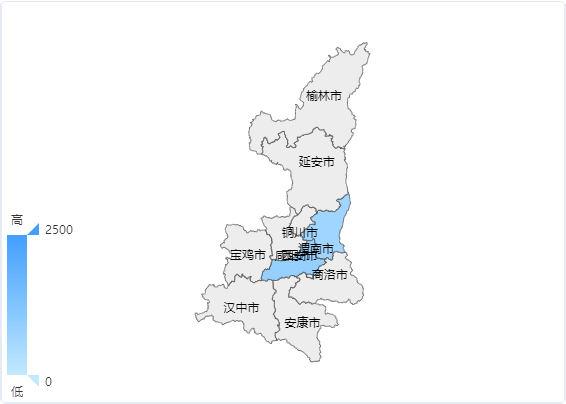
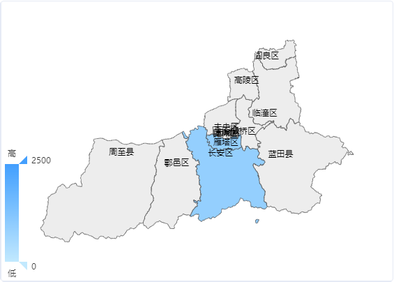

# echarts-geo-json

中国省市区县行政区划边界GeoJSON数据下载转换




* [x] 生成省市区县csv格式行政数据
* [x] 生成名称-行政编码对照列表
* [x] 调用高德行政区划接口下载数据
* [x] 生成echarts指定的的GeoJson数据
* [x] 采用ZigZag编码压缩coordinates

## Run
```shell
npm run start
```

## LICENSE
[MIT](LICENSE)
